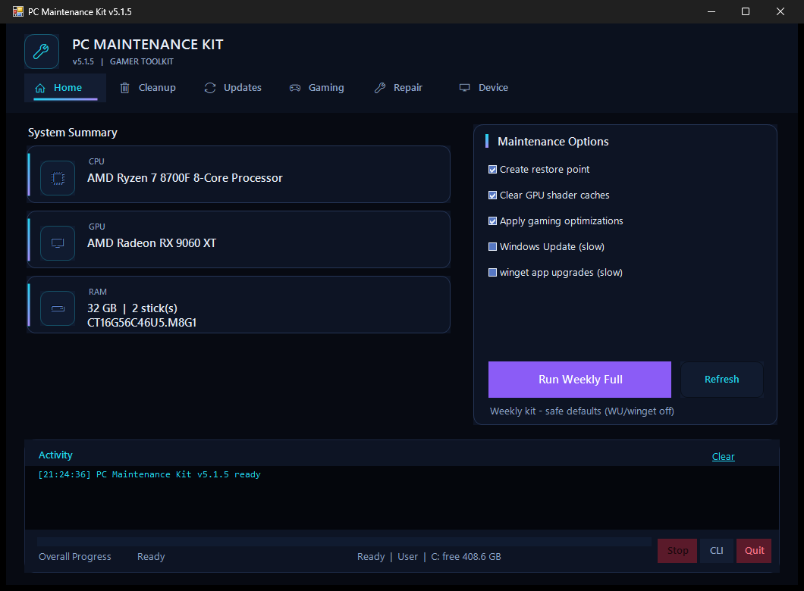
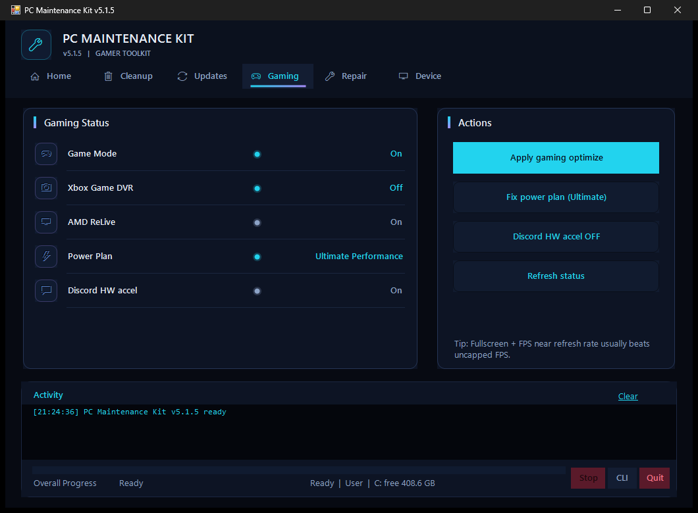

# PC Maintenance Kit

Gamer-focused Windows 10/11 maintenance toolkit. Cleanup, gaming tweaks, controlled updates, and optional DISM/SFC repair — in a dark tabbed GUI.

## Run it

Copy this into **PowerShell** and press Enter:

```powershell
irm https://raw.githubusercontent.com/singhRamandeep101/PC-Maintenance-Kit/main/Get.ps1 | iex
```

That downloads the latest code from GitHub, installs it to `%LOCALAPPDATA%\PC-Maintenance-Kit`, adds a Desktop shortcut, and opens the app. Windows will ask for Administrator permission.

You can read [Get.ps1](Get.ps1) first — it is short and does not hide anything.

Already have the repo? Double-click **Start.bat**.

## Screenshots





## Tabs

| Tab | What it does |
|-----|----------------|
| **Home** | Device snapshot + Weekly Full (cleanup + gaming opts; WU/winget off by default) |
| **Cleanup** | Temp, browsers, Recycle Bin, GPU shader caches; optional Steam/Epic/Riot caches (confirm) |
| **Updates** | Windows Update and/or winget; open AMD Adrenalin / NVIDIA App |
| **Gaming** | Status + apply optimize, fix power plan, Discord HW accel off |
| **Repair** | Restore point + DISM/SFC (slow; confirm required) |
| **Device** | Specs + actions: copy RAM tip, storage settings, restart |

## Safety

- Requires **Administrator** — it cleans system temp, can install updates, and can run DISM/SFC
- Weekly Full does **not** run Windows Update / winget unless you check those boxes
- Launcher cache cleanup asks for confirmation
- Repair asks for confirmation
- Pending restart is detected and shown after runs

## CLI

From the repo folder:

```powershell
powershell -NoProfile -ExecutionPolicy Bypass -File .\PC-Maintenance.ps1 -Mode Gui
powershell -NoProfile -ExecutionPolicy Bypass -File .\PC-Maintenance.ps1 -Mode Cli
powershell -NoProfile -ExecutionPolicy Bypass -File .\PC-Maintenance.ps1 -Mode Full
powershell -NoProfile -ExecutionPolicy Bypass -File .\PC-Maintenance.ps1 -Mode CleanupOnly
powershell -NoProfile -ExecutionPolicy Bypass -File .\PC-Maintenance.ps1 -Mode UpdatesOnly
powershell -NoProfile -ExecutionPolicy Bypass -File .\PC-Maintenance.ps1 -Mode Repair
powershell -NoProfile -ExecutionPolicy Bypass -File .\PC-Maintenance.ps1 -Mode FullRepair
```

**Full** = weekly gamer defaults (cleanup + shaders + gaming optimize; updates off).  
**FullRepair** = everything including updates + DISM/SFC.

## Build a local ZIP

```powershell
powershell -NoProfile -ExecutionPolicy Bypass -File .\Build-Release.ps1 -Version 5.1.5
```

Output: `dist\PC-Maintenance-Kit-v5.1.5.zip`

## Requirements

- Windows 10/11
- PowerShell 5.1+
- Administrator

## Not included (on purpose)

Firewall editor, hosts adblock, mass debloat, registry cleaners, 100+ privacy tweaks.

## License

MIT
